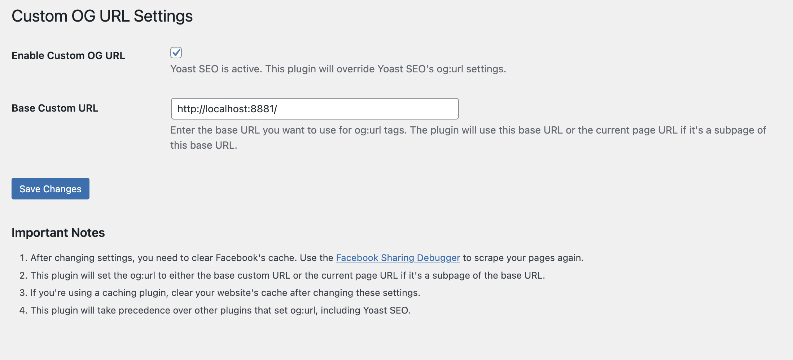

# Easy OG URL

Easy OG URL is a simple WordPress plugin that makes managing the og:url meta tag for Facebook sharing effortless. It works with Facebook's requirements and can override other plugins.

## Features

- Set a custom base URL for og:url tags
- Use the current page URL for subpages automatically
- Set custom og:url for individual posts and pages
- Override og:url settings from other plugins, including Yoast SEO
- Simple settings page in WordPress admin

## Screenshot

## Installation

1. Download the Easy OG URL zip file.
2. Go to Plugins > Add New in your WordPress admin.
3. Click "Upload Plugin" and select the zip file.
4. Click "Install Now" and then "Activate".

## Usage

1. Go to Settings > Easy OG URL in your WordPress admin.
2. Check "Enable Easy OG URL" to activate.
3. Enter your base URL in the "Base URL" field.
4. Click "Save Changes".
5. To set a custom og:url for an individual post or page:
   - Edit the post or page
   - Find the "Easy OG:URL" meta box
   - Enter the custom og:url in the provided field
   - Update the post or page

## Important Notes

- After changing settings, clear Facebook's cache using the [Facebook Sharing Debugger](https://developers.facebook.com/tools/debug/).
- The plugin will use either your base URL, the current page URL for subpages, or the custom og:url set for individual posts/pages.
- Clear your website's cache if you use a caching plugin.
- This plugin will override og:url settings from other plugins, including Yoast SEO.

## Compatibility

Easy OG URL works with most WordPress themes and plugins, including Yoast SEO.

## Support

For help, please open an issue on the [GitHub repository](https://github.com/themrboyd/easy-og-url).

## Contributing

Contributions are welcome! Feel free to submit a Pull Request.

## Support the Development

If you find this plugin useful, consider supporting its development:

## License

This project is licensed under the GPL-2.0+ License.

## Author

Boyd Duang
- GitHub: [https://github.com/themrboyd](https://github.com/themrboyd)
- Ko-fi: [https://ko-fi.com/boyduang](https://ko-fi.com/boyduang)
- Buy Me a Coffee: [https://buymeacoffee.com/boyduang](https://buymeacoffee.com/boyduang)